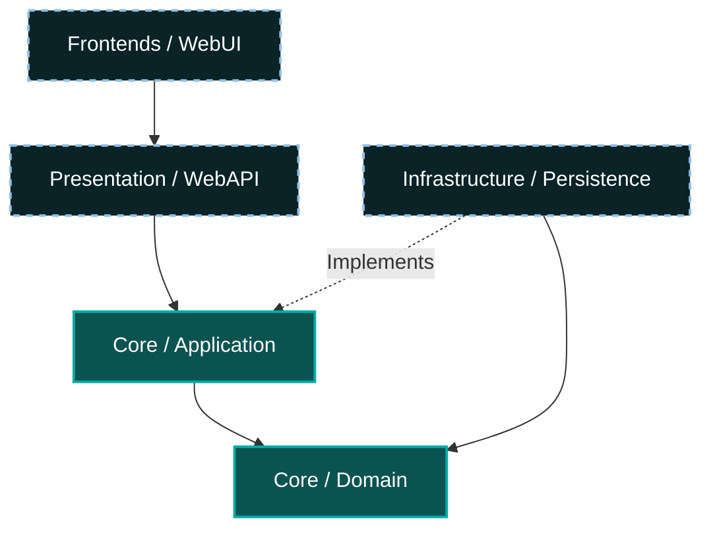

# DriveLux - Enterprise Car Rental Management System

DriveLux is a full-featured, enterprise-grade Car Rental Management System built with **ASP.NET Core 8.0** using **Onion Architecture**. Designed for scalability, maintainability, and high performance, it provides a seamless experience for both administrators and customers.

## 🚀 Key Features

### 🌐 Customer Portal
- **Advanced Search**: Filter vehicles by location, date, brand, and features.
- **Seamless Booking**: Real-time reservation system with instant confirmation.
- **Blog & News**: Stay updated with the latest car trends and company news.
- **Contact & Support**: Integrated communication system for customer inquiries.

### 🛠 Administrative Dashboard
- **Fleet Management**: Complete control over vehicle inventory, specifications, and pricing.
- **Brand Management**: Manage multiple car brands and their associated metadata.
- **Booking Insights**: Real-time statistics and reservation tracking.
- **Content Management (CMS)**: Full control over banners, testimonials, authors, and blog categories.
- **Dynamic Services**: Custom service management to highlight premium offerings.

## 🏗 Technical Stack & Architecture

This project strictly adheres to **Onion Architecture** principles to ensure the separation of infrastructural concerns from business logic, resulting in a highly maintainable and testable codebase.



- **Core Layer (Domain & Application)**: Contains enterprise logic, entities, MediatR handlers (CQRS), and defining interfaces. Completely independent of data access or UI.
- **Infrastructure Layer (Persistence)**: Implements the interfaces defined in the Application layer (e.g., Repositories) using EF Core.
- **Presentation Layer (WebAPI)**: REST endpoints strictly responsible for receiving requests and dispatching them via MediatR.
- **Frontend Layer (WebUI)**: Consumes the API to deliver a rich user experience built with ASP.NET Core MVC.

### Core Technologies
- **Backend**: .NET 8.0, ASP.NET Core Web API, Entity Framework Core (SQL Server)
- **Patterns**: CQRS (MediatR), Repository Pattern, Unit of Work
- **Validation**: FluentValidation
- **Frontend**: ASP.NET Core MVC, HTML5, CSS3, JavaScript, Bootstrap 5

## 📂 Project Structure

```
DriveLux
├── Core
│   ├── DriveLux.Domain        # Entities & Base Types
│   └── DriveLux.Application   # Business Logic, CQRS, Interfaces
├── Infrastructure
│   └── DriveLux.Persistence   # Data Access, Migrations, EfCore
├── Presentation
│   └── DriveLux.WebAPI        # REST API Endpoints
└── Frontends
    ├── DriveLux.WebUI         # MVC Web Application
    └── DriveLux.DTO           # Shared Data Transfer Objects
```

## ⚙️ Getting Started (Local Development)

Follow these steps to set up and run the DriveLux project on your local machine.

### Prerequisites
- [.NET 8.0 SDK](https://dotnet.microsoft.com/en-us/download/dotnet/8.0)
- [Visual Studio 2022](https://visualstudio.microsoft.com/vs/) (Recommended) or VS Code
- [SQL Server](https://www.microsoft.com/en-us/sql-server/sql-server-downloads) (Express or Developer edition)

### Step-by-Step Setup

1. **Clone the repository**:
   ```bash
   git clone git@github.com:ibrahimkizilarslan/car-rental-onion.git
   cd car-rental-onion
   ```

2. **Configure the Database Connection**:
   - Open the solution `DriveLux.sln` in Visual Studio.
   - Navigate to `Presentation/DriveLux.WebAPI/appsettings.json`.
   - Update the `DefaultConnection` string to point to your local SQL Server instance.
   ```json
   "ConnectionStrings": {
     "DefaultConnection": "Server=YOUR_SERVER_NAME;Database=DriveLuxDb;Trusted_Connection=True;TrustServerCertificate=True"
   }
   ```

3. **Apply Database Migrations**:
   You need to create the database schema using Entity Framework Core tools.
   
   *Via Visual Studio Package Manager Console (Targeting DriveLux.WebAPI):*
   ```powershell
   Update-Database
   ```
   
   *Or via .NET CLI:*
   Navigate to the API directory and run the update command:
   ```bash
   cd Presentation/DriveLux.WebAPI
   dotnet ef database update --project ../../Infrastructure/DriveLux.Persistence
   ```

4. **Run the Application (Multiple Startup Projects)**:
   For the system to work fully, you need to run both the API and the WebUI simultaneously.
   
   *In Visual Studio:*
   - Right-click the Solution `DriveLux` in Solution Explorer.
   - Select **Properties** -> **Startup Project**.
   - Choose **Multiple startup projects**.
   - Set the Action for both `DriveLux.WebAPI` and `DriveLux.WebUI` to **Start**.
   - Press **F5**.
   
   *Via .NET CLI (Open two terminals):*
   **Terminal 1 (Backend API):**
   ```bash
   cd Presentation/DriveLux.WebAPI
   dotnet run
   ```
   **Terminal 2 (Frontend UI):**
   ```bash
   cd Frontends/DriveLux.WebUI
   dotnet run
   ```

5. **Access the System**:
   - **Swagger API Documentation:** Typically defaults to `https://localhost:7281/swagger` or `http://localhost:5120/swagger`.
   - **Customer Portal & Admin UI:** Typically defaults to `https://localhost:7039` or `http://localhost:5104`. The Admin panel can usually be accessed via the UI routing depending on the auth setup.
